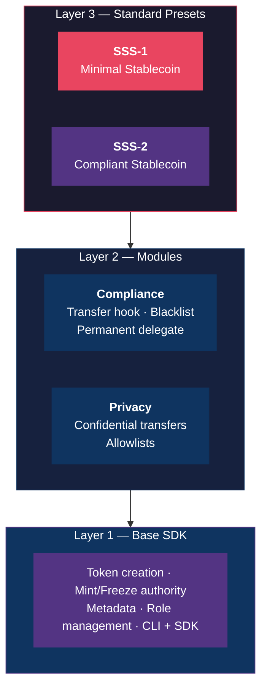
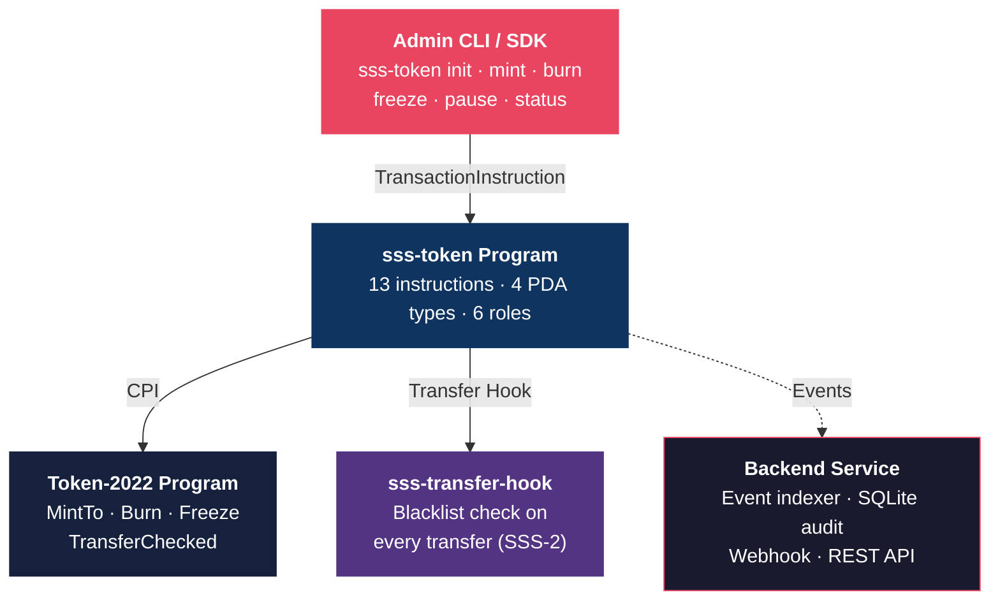

# Solana Stablecoin Standard (SSS)

A modular, production-ready SDK for building stablecoins on Solana using Token-2022 extensions.

## Architecture

Three-layer design:



## Standards

| Standard | Name | Description |
|----------|------|-------------|
| **SSS-1** | Minimal Stablecoin | Mint authority + freeze authority + metadata. For internal tokens, DAO treasuries, ecosystem settlement. |
| **SSS-2** | Compliant Stablecoin | SSS-1 + permanent delegate + transfer hook + blacklist enforcement. For regulated stablecoins (USDC/USDT-class). |

## Quick Start

### Prerequisites

- Rust 1.75+
- Solana CLI 2.0+
- Anchor CLI 0.31.1
- Node.js 20+
- Yarn 1.22+

### Build & Test

```bash
# Install dependencies
yarn install

# Build on-chain programs
anchor build

# Run tests (starts local validator)
anchor test

# Deploy to devnet
anchor deploy --provider.cluster devnet
```

### CLI Usage

```bash
# Initialize an SSS-1 stablecoin
sss-token init --preset sss-1 --name "My Token" --symbol "MYUSD"

# Initialize an SSS-2 compliant stablecoin
sss-token init --preset sss-2 --name "Regulated Token" --symbol "RUSD"

# Operations
sss-token mint <recipient> <amount>
sss-token burn <amount>
sss-token freeze <address>
sss-token thaw <address>
sss-token pause
sss-token unpause
sss-token status

# SSS-2 compliance
sss-token blacklist add <address> --reason "OFAC match"
sss-token blacklist remove <address>
sss-token seize <address> --to <treasury>
```

### TypeScript SDK

```typescript
import { SolanaStablecoin, Presets } from "@stbr/sss-sdk";

// Create an SSS-2 compliant stablecoin
const stable = await SolanaStablecoin.create(connection, {
  preset: Presets.SSS_2,
  name: "My Stablecoin",
  symbol: "MYUSD",
  decimals: 6,
  authority: adminKeypair,
});

// Mint tokens
await stable.mint({ recipient, amount: 1_000_000, minter });

// Compliance operations (SSS-2 only)
await stable.compliance.blacklistAdd(address, "Sanctions match");
await stable.compliance.seize(frozenAccount, treasury);
```

### Backend Services

```bash
# Start backend with Docker
docker compose up

# Health check
curl http://localhost:3000/health
```

## System Components



## Project Structure

```
programs/
├── sss-token/              # Main stablecoin Anchor program (13 instructions)
└── sss-transfer-hook/      # Transfer hook for blacklist enforcement (SSS-2)
sdk/
├── core/                   # TypeScript SDK (@stbr/sss-sdk)
└── cli/                    # Admin CLI (sss-token)
backend/                    # Express.js backend (event indexer + REST API)
tests/                      # Integration tests (SSS-1 + SSS-2 lifecycle)
docs/                       # Documentation (7 guides)
```

## Role-Based Access Control

| Role | Capabilities | Required For |
|------|-------------|--------------|
| Master Authority | Update roles, transfer authority | All presets |
| Minter | Mint tokens (per-minter quotas) | All presets |
| Burner | Burn tokens | All presets |
| Pauser | Pause/unpause all operations | All presets |
| Blacklister | Add/remove from blacklist | SSS-2 |
| Seizer | Seize tokens via permanent delegate | SSS-2 |

## Examples

10 step-by-step examples from "hello world" to full compliance lifecycle:

```bash
npx tsx examples/1-basic-sss1.ts          # Your first stablecoin
npx tsx examples/10-full-lifecycle.ts      # Complete end-to-end scenario
```

See [examples/README.md](examples/README.md) for the full list.

## Documentation

- [Architecture](docs/ARCHITECTURE.md) — Layer model, data flows, security
- [SDK Reference](docs/SDK.md) — Presets, custom configs, TypeScript examples
- [Operations](docs/OPERATIONS.md) — Operator runbook
- [SSS-1 Spec](docs/SSS-1.md) — Minimal stablecoin standard
- [SSS-2 Spec](docs/SSS-2.md) — Compliant stablecoin standard
- [Compliance](docs/COMPLIANCE.md) — Regulatory considerations, audit trail
- [API Reference](docs/API.md) — Backend API endpoints
- [Examples](examples/README.md) — 10 hands-on SDK examples

## License

MIT
