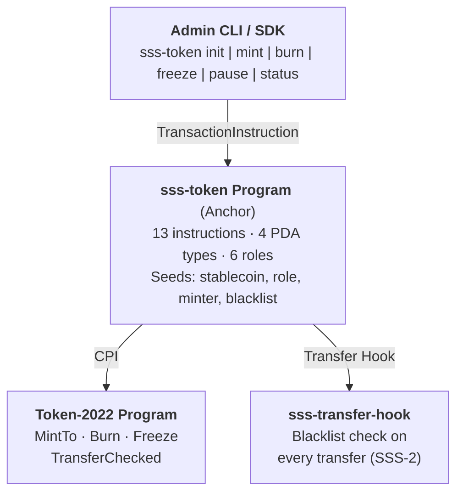
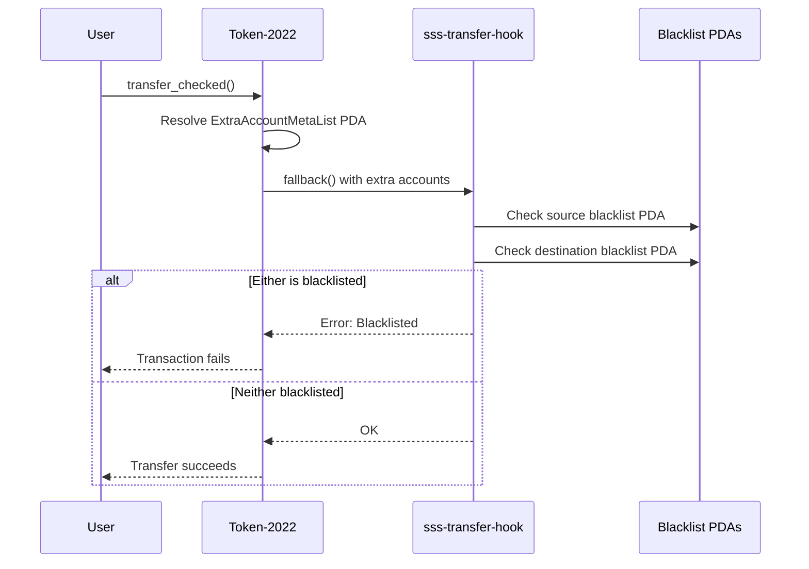

# Architecture

## Overview

The Solana Stablecoin Standard (SSS) is a modular framework for issuing regulated stablecoins on Solana using Token-2022 extensions. It provides two preset configurations:

- **SSS-1 (Minimal)**: Basic mint/burn, freeze/thaw, pause controls
- **SSS-2 (Compliant)**: Full regulatory suite — permanent delegate seizure, transfer hook blacklist enforcement, default-frozen KYC gate

## System Components

## PDA Account Layout

| PDA | Seeds | Size | Purpose |
|-----|-------|------|---------|
| `StablecoinState` | `["stablecoin", mint]` | 330 bytes | Config, operational state, authority |
| `RoleAccount` | `["role", stablecoin, holder]` | 78 bytes | Per-user role flags (5 bools) |
| `MinterInfo` | `["minter", stablecoin, minter]` | 89 bytes | Per-minter quota tracking |
| `BlacklistEntry` | `["blacklist", stablecoin, address]` | 217 bytes | Per-address blacklist (SSS-2) |

## Role-Based Access Control

| Role | Capabilities |
|------|-------------|
| Master Authority | Update roles, transfer authority, manage minters |
| Minter | Mint tokens up to assigned quota |
| Burner | Burn tokens from own account |
| Pauser | Pause/unpause, freeze/thaw accounts |
| Blacklister | Add/remove addresses from blacklist (SSS-2) |
| Seizer | Seize tokens via permanent delegate (SSS-2) |

## Feature Gating

SSS-2 instructions check `stablecoin.is_sss2()` (both `enable_permanent_delegate` and `enable_transfer_hook` must be `true`). If called on an SSS-1 stablecoin, they return `ComplianceNotEnabled`.

## Token-2022 Extensions Used

1. **MintCloseAuthority** — allows closing empty mints
2. **PermanentDelegate** (SSS-2) — enables seizure without owner consent
3. **TransferHook** (SSS-2) — calls `sss-transfer-hook` on every transfer
4. **DefaultAccountState** (SSS-2) — new accounts start frozen (KYC gate)

## Transfer Hook Flow

