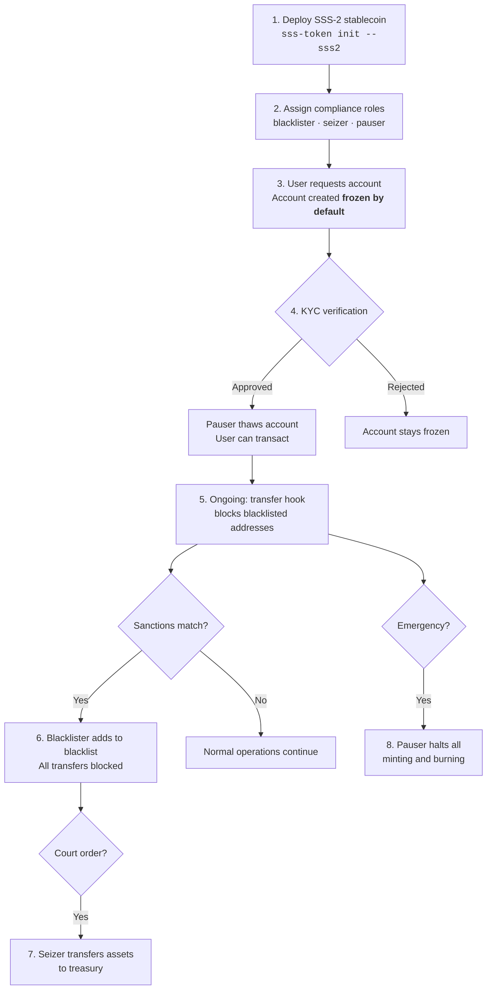

# Compliance Guide

## Regulatory Framework

SSS-2 is designed to meet requirements for regulated stablecoin issuers:

| Requirement | SSS-2 Feature |
|------------|---------------|
| KYC/AML gate | Default-frozen accounts (thaw after verification) |
| Sanctions screening | Transfer hook blacklist enforcement |
| Asset freezing | Individual account freeze/thaw |
| Law enforcement seizure | Permanent delegate transfer |
| Audit trail | 13 on-chain events + SQLite indexer |
| Emergency shutdown | Global pause/unpause |

## Compliance Roles

### Blacklister
- Adds/removes addresses from the on-chain blacklist
- Blacklisted addresses cannot send OR receive tokens
- Transfer hook checks both source and destination

### Seizer
- Can transfer the full balance of any token account to a treasury
- Uses Token-2022's permanent delegate extension
- Does not require account owner's consent
- Emits `TokensSeized` event with full audit details

### Pauser
- Freezes/thaws individual token accounts
- Pauses/unpauses global minting and burning
- Controls KYC gate (thaw = approved)

## Event Audit Trail

All 13 operations emit Anchor events captured by the backend:

```
StablecoinInitialized, TokensMinted, TokensBurned,
AccountFrozen, AccountThawed, StablecoinPaused,
StablecoinUnpaused, RolesUpdated, MinterUpdated,
AuthorityTransferred, AddedToBlacklist,
RemovedFromBlacklist, TokensSeized
```

## Backend Integration

The Express.js backend provides:

1. **Event indexer** — captures all program events via WebSocket
2. **SQLite audit trail** — persisted, queryable event history
3. **Webhook system** — push notifications for compliance events
4. **REST API** — query stablecoin status, events, operations

## Compliance Workflow


