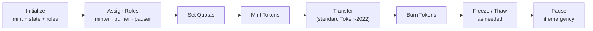

# SSS-1: Minimal Stablecoin Standard

## Overview

SSS-1 is the lightweight preset for issuing basic stablecoins on Solana. It provides essential operational controls without regulatory compliance features.

## Features

- **Mint/Burn** with per-minter quota enforcement
- **Freeze/Thaw** individual token accounts
- **Pause/Unpause** global operations (minting + burning)
- **Role-based access** with 5 configurable roles
- **Authority transfer** for governance transitions
- **MintCloseAuthority** extension for cleanup

## Token-2022 Extensions

| Extension | Enabled |
|-----------|---------|
| MintCloseAuthority | Yes |
| PermanentDelegate | No |
| TransferHook | No |
| DefaultAccountState | No |

## Lifecycle



## Configuration

```typescript
sss1Preset({
  name: "My Stablecoin",
  symbol: "MUSD",
  decimals: 6,
  uri: "https://example.com/metadata.json",
})
```

## CLI Usage

```bash
# Initialize SSS-1 stablecoin
sss-token init --name "My USD" --symbol MUSD --decimals 6

# Assign minter role
sss-token roles --mint <MINT> --holder <PUBKEY> --minter

# Set quota and mint
sss-token minters --mint <MINT> --minter <PUBKEY> --quota 1000000
sss-token mint --mint <MINT> --to <TOKEN_ACCOUNT> --amount 500000

# Check status
sss-token status --mint <MINT>
```
