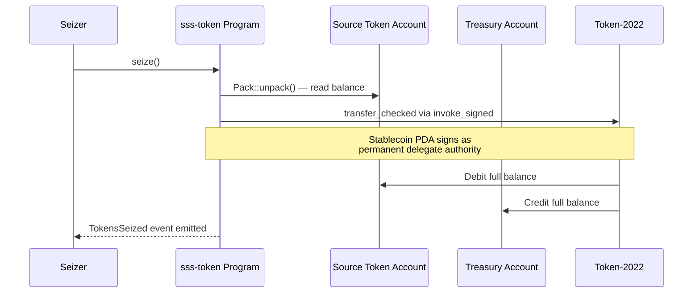

# SSS-2: Compliant Stablecoin Standard

## Overview

SSS-2 extends SSS-1 with full regulatory compliance capabilities. It enables FATF travel rule compliance, sanctions screening, and law enforcement cooperation through three additional Token-2022 extensions.

## Additional Features (over SSS-1)

- **Blacklist enforcement** on every transfer via transfer hook
- **Asset seizure** via permanent delegate authority
- **Default-frozen accounts** as KYC gate (accounts must be thawed before use)

## Token-2022 Extensions

| Extension | Purpose |
|-----------|---------|
| MintCloseAuthority | Cleanup empty mints |
| PermanentDelegate | Seize tokens from any account without owner consent |
| TransferHook | Calls `sss-transfer-hook` on every `transfer_checked` |
| DefaultAccountState | New accounts start frozen — must be thawed (KYC approved) |

## Blacklist System

Each blacklisted address gets its own PDA:
- Seeds: `["blacklist", stablecoin, address]`
- Contains: reason, timestamp, blacklisted_by
- Transfer hook checks existence of source + destination blacklist PDAs
- PDA with data = blacklisted → transfer rejected

## Seizure Flow



## KYC Gate

With `defaultAccountFrozen: true`, every new token account starts frozen. The pauser must explicitly thaw each account after KYC verification. This ensures only verified users can hold tokens.

## CLI Usage

```bash
# Initialize SSS-2 stablecoin
sss-token init --name "Compliant USD" --symbol cUSD --sss2

# KYC: thaw approved accounts
sss-token freeze --mint <MINT> --account <TOKEN_ACCOUNT> --thaw

# Blacklist management
sss-token blacklist --mint <MINT> --action add --address <PUBKEY> --reason "Sanctions"
sss-token blacklist --mint <MINT> --action remove --address <PUBKEY>

# Seize assets
sss-token seize --mint <MINT> --source <FROM_ACCOUNT> --destination <TREASURY_ACCOUNT>
```
